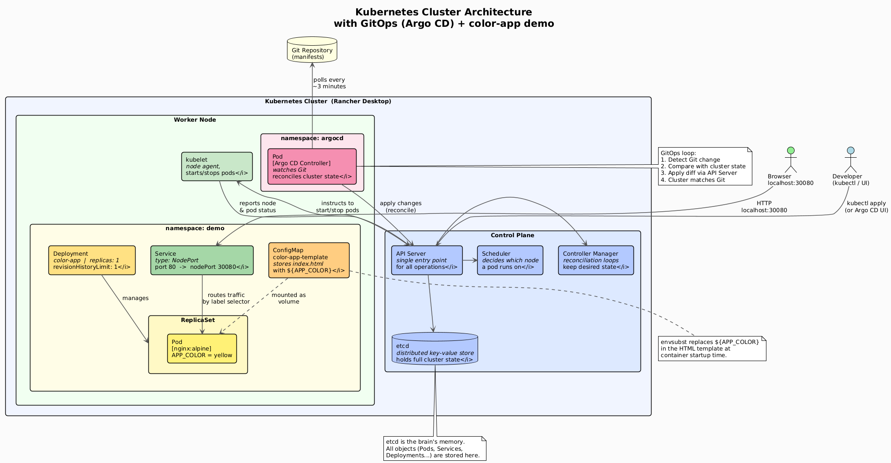
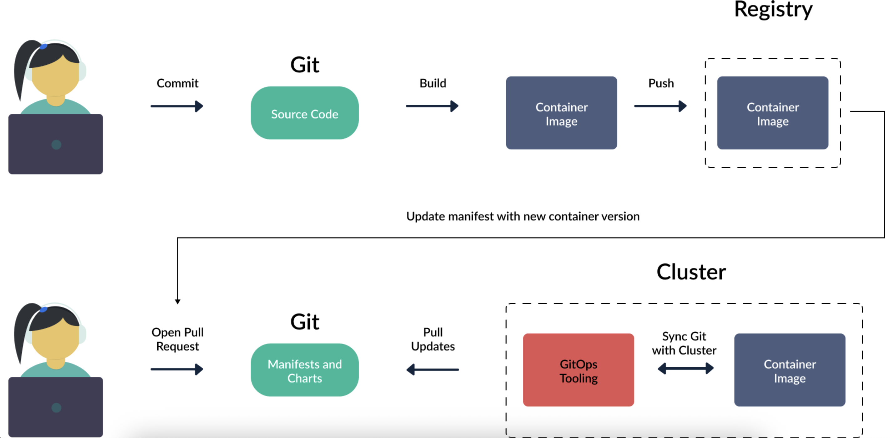
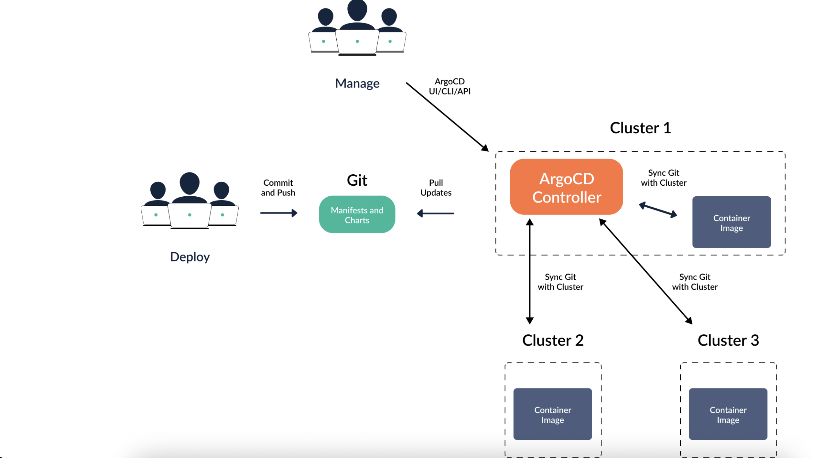
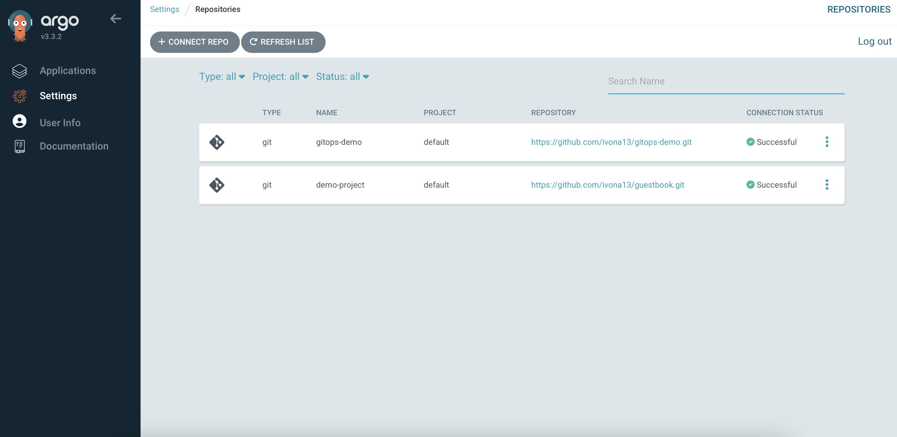
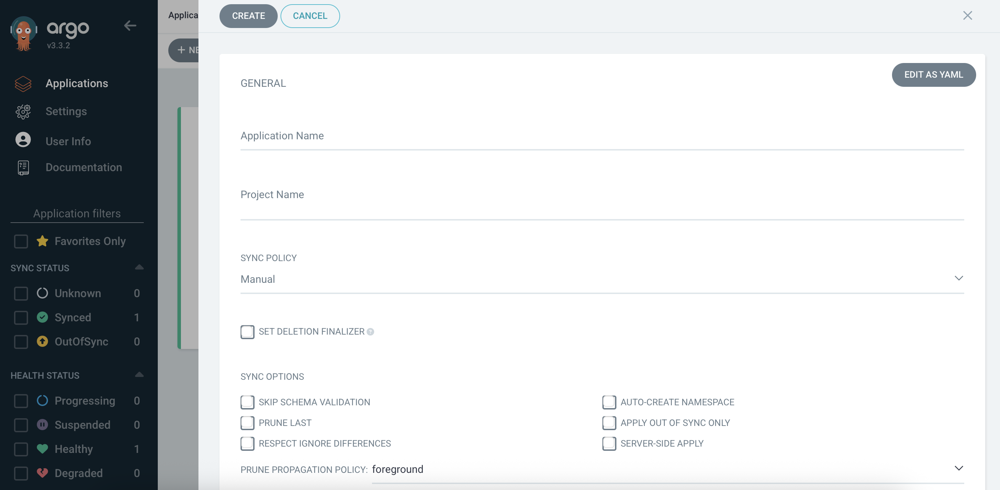
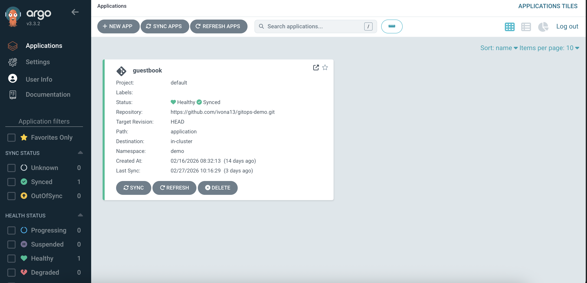
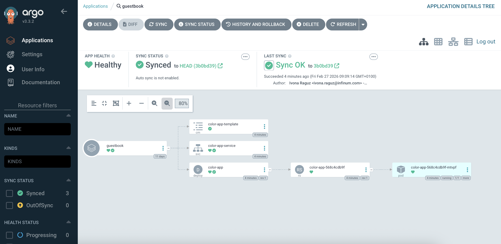
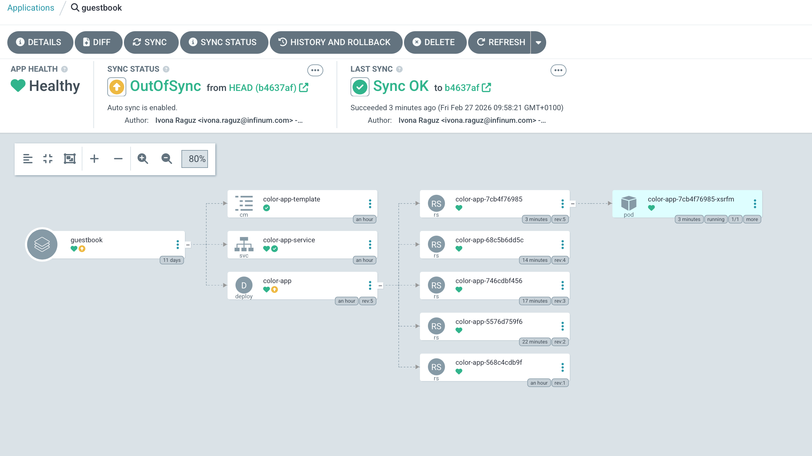
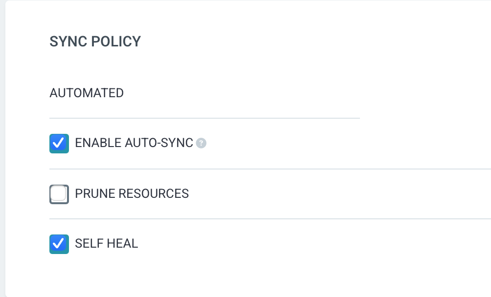

## GitOps with Argo CD

---

### Kubernetes (K8s) — Introduction

Kubernetes (K8s) is an open-source **container orchestration platform**. It automates deployment, scaling, self-healing, and management of containerized workloads across a cluster of machines.

---

### Why Kubernetes?

Imagine you have 10 microservices, each running as a container. You have 3 servers. Questions:

- Which container runs on which server?
- What happens if a server dies at 3am?
- How do you deploy a new version without downtime?
- How do you route traffic between services?
- How do you scale one service without touching the others?

Doing this manually is possible — but painful, error-prone, and does not scale. Kubernetes automates all of it.

**Kubernetes gives you:**

- **Self-healing** — dead containers are restarted, dead nodes are replaced
- **Horizontal scaling** — add replicas with one YAML change (or automatically)
- **Rolling deployments** — new version rolls out pod by pod; no downtime
- **Service discovery** — every Service gets a DNS name inside the cluster
- **Load balancing** — traffic is automatically spread across healthy pods
- **Config separation** — ConfigMaps and Secrets keep config out of images
- **Declarative management** — describe *what* you want, not *how* to do it

**The mental model shift:**
```
Old way (imperative):   "SSH into server 2, stop container, pull new image, start container"
K8s way (declarative):  "I want 3 replicas of nginx:1.26" → K8s figures out the rest
```

> The core idea: you **declare the desired state** in YAML files. Kubernetes continuously reconciles the actual state of the cluster toward that desired state — automatically, forever.

---

### Cluster Architecture

A Kubernetes cluster has two main parts: the **Control Plane** (the brain) and **Worker Nodes** (where your workloads actually run).



---

### Core Components Explained

#### Control Plane

| Component | Role |
|---|---|
| **API Server** | The front door of the cluster. Every interaction — `kubectl`, internal components — goes through the API Server. It validates and processes requests, then writes to etcd. |
| **etcd** | A distributed key-value store. This is where the entire state of the cluster lives — every object, every status, every config. If etcd is healthy, the cluster can recover from anything. |
| **Scheduler** | Watches for newly created pods that have no node assigned and selects the best node based on available resources, constraints, and policies. |
| **Controller Manager** | Runs a set of controllers in a single process. Each controller watches a specific resource type and reconciles actual state toward desired state. Examples: `ReplicaSet controller`, `Deployment controller`, `Node controller`. |

#### Worker Node

| Component | Role |
|---|---|
| **kubelet** | The node agent. It receives pod specs from the API Server and ensures the described containers are running and healthy. It reports back the node and pod status. |
| **kube-proxy** | Runs on every node and maintains network rules. It implements the Service abstraction — routing traffic to the correct pods based on labels. |
| **Container Runtime** | The software that actually runs containers (e.g. `containerd`, `CRI-O`). Kubernetes talks to it via the Container Runtime Interface (CRI). |

---

### Key Workload Objects

#### Pod
The **smallest deployable unit** in Kubernetes. A Pod wraps one or more containers that share the same network namespace and storage volumes. Pods are ephemeral — when they die, they are gone. You never manage pods directly in production; you use higher-level objects.

```yaml
# Pod spec (simplified — usually managed by a Deployment)
spec:
  containers:
    - name: app
      image: nginx:alpine
      ports:
        - containerPort: 80
```

#### ReplicaSet
Ensures a specified number of identical pod replicas are running at all times. If a pod crashes, ReplicaSet creates a new one. If you scale down, it deletes extras. You rarely create ReplicaSets directly — Deployments do it for you.

#### Deployment
The standard way to run stateless applications. Wraps ReplicaSets and adds:
- **Rolling updates** — gradually replaces old pods with new ones
- **Rollbacks** — revert to a previous ReplicaSet with one command
- **Declarative updates** — change the image tag in YAML and apply; Kubernetes handles the rest

```yaml
spec:
  replicas: 3
  strategy:
    type: RollingUpdate
    rollingUpdate:
      maxUnavailable: 1   # at most 1 pod down at a time
      maxSurge: 1         # at most 1 extra pod during update
```

#### Service
Pods get new IP addresses every time they restart. A **Service** provides a stable DNS name and virtual IP that always routes to live pods matched by a label selector. Types: `ClusterIP` (internal), `NodePort` (exposed on node, used here), `LoadBalancer` (cloud), `Ingress` (HTTP routing).

#### Labels, Selectors & Annotations
This is the **glue of Kubernetes** — how objects find and relate to each other. Everything is connected through labels.

```yaml
# A Pod declares labels:
metadata:
  labels:
    app: color-app
    env: demo

# A Service selects pods by label — no hardcoded pod names or IPs needed:
spec:
  selector:
    app: color-app   # routes traffic to any pod with this label

# A Deployment uses the same mechanism to manage its pods:
spec:
  selector:
    matchLabels:
      app: color-app
```

> If you change a pod's label manually, the Service immediately stops routing to it and the Deployment no longer considers it managed. Labels are runtime — they are evaluated continuously.

**Annotations** are similar but for metadata that tools read (not selectors): deployment timestamps, Argo CD managed-by info, monitoring scrape configs, etc.

#### ConfigMap & Secret
Decouple configuration from container images.

| Object | Use for | Stored as |
|---|---|---|
| `ConfigMap` | Non-sensitive config: env vars, config files, feature flags | Plain text |
| `Secret` | Sensitive data: passwords, API keys, TLS certificates | Base64-encoded (+ encryption at rest in production) |

#### Namespace
A virtual cluster inside the physical cluster. Used to isolate environments (`dev`, `staging`, `prod`), teams, or applications — each with its own resource quotas and RBAC policies.


---

### The Reconciliation Loop

This is the core concept that makes Kubernetes (and GitOps) work:

```
  Desired state (YAML in Git / etcd)     Actual state (running cluster)
  ────────────────────────────────       ────────────────────────────────
  replicas: 3                            replicas: 2   ← pod crashed

                    Controller Manager detects the diff
                              ↓
                    Creates 1 new pod to match desired state
                              ↓
  replicas: 3                            replicas: 3   ← reconciled
```

This loop runs **continuously** for every object in the cluster. It is why Kubernetes is self-healing — you never have to manually fix things, you just declare what you want.

---


### GitOps
GitOps is a set of best practices where the entire code delivery process is managed through Git. Both infrastructure and applications are defined as code, and automation is used to perform deployments, updates, and rollbacks.

Key GitOps principles:

- The entire system (infrastructure and applications) is described declaratively.
- The desired state of the system is versioned and stored in Git.
- Approved changes are automatically applied to the system.
- Software agents continuously ensure correctness and alert on any drift.

In Kubernetes, GitOps deployments typically work like this:

- A GitOps agent is deployed in the cluster.
- The agent monitors one or more Git repositories that define applications using Kubernetes manifests, Helm charts, or Kustomize files.
- When a new Git commit is pushed, the agent reconciles the cluster so that its state matches what is described in Git.
- All changes are made via Git operations; the cluster is never modified directly (no manual `kubectl` commands).

With GitOps, the deployment process looks like this:

- A developer commits application source code; the CI system builds a container image and pushes it to a registry.
- Nobody has direct access to the Kubernetes cluster. A separate Git repository stores the manifests that define the application.
- Another human or an automated system updates the manifests in this second Git repository.
- A GitOps controller running inside the cluster watches this repository and, when it detects changes, updates the cluster to match the state declared in Git.



Key points:
- The state of the cluster is always described in Git; Git contains everything related to the application, not just the source code.
- There is no external CI/deployment system with full write access to the cluster; instead, the cluster pulls changes and deployment information from Git.
- The GitOps controller runs continuously, reconciling the actual cluster state with the desired state stored in Git.

### GitOps use cases

#### Continuous Deployment
The most common use case. Every merge to the main branch triggers a pipeline that builds a new container image and updates the image tag in the Git config repo. Argo CD picks up the change and rolls it out automatically — no manual steps, no surprises.

```
Code PR merged → CI builds image → updates manifest in Git → Argo CD deploys → Done ✅
```

#### Environment Promotion
You maintain separate branches or folders in Git for `dev`, `staging`, and `production`. Promoting a release means opening a pull request that updates the relevant manifest. Peer review happens in Git — you get full visibility and approval gates before anything touches production.

```
dev branch → PR review → merge to staging → PR review → merge to production
```

#### Disaster Recovery
Because the entire desired state of your cluster lives in Git, recovering from a disaster is as simple as pointing a new cluster at the same Git repository. Argo CD will recreate all your applications from scratch within minutes.

```
Cluster lost → Provision new cluster → Install Argo CD → Point at same Git repo → Fully restored 🔄
```

#### Multi-Cluster Management
A single Argo CD installation can manage applications across multiple clusters — useful for regional deployments, multi-cloud setups, or separating workloads. The same Git repo drives all of them, with cluster-specific values handled by Helm or Kustomize overlays.

#### Drift Detection & Compliance
Even without auto-sync enabled, Argo CD continuously checks whether the cluster matches Git. If someone makes an unauthorized manual change (`kubectl edit`, `kubectl scale`), Argo CD immediately flags the application as **OutOfSync** — giving you real-time visibility into configuration drift. This is valuable for compliance and audit requirements.


## Argo CD

### Introduction
We will apply GitOps practices to Kubernetes applications using Argo CD as our GitOps controller.

Argo CD implements the GitOps principles described above in the following way:

- Argo CD is installed as a controller in a Kubernetes cluster. It is typically installed on the same cluster it manages, but it can also manage external clusters.
- Application manifests are stored in Git. Argo CD is agnostic about the type of manifests you use: it supports plain Kubernetes manifests, Helm charts, Kustomize overlays, and other templating mechanisms.
- You define an Argo CD Application that specifies which Git repository (and path/revision) to track and which cluster/namespace to deploy to.
- From that point on, Argo CD continuously monitors the Git repository. When it detects a change, it reconciles the cluster so that its state matches what is declared in Git.
- Optionally, a single Argo CD installation can deploy and manage applications across multiple clusters, not just the cluster where Argo CD itself runs.



### Installation
- Prerequisites:
  - Rancher local cluster: 
  ```bash
  Preferences > Kubernetes > Enable Kubernetes > Cluster Dashboard
  ```
  - kubectl installed: https://kubernetes.io/docs/tasks/tools/install-kubectl-macos/
  ```bash
  brew install kubectl
  kubectl version --client
  ```
- Setup context: 
```bash
kubectl config use-context rancher-desktop
kubectl config current-context
```
- Fork repository and clone it locally: https://github.com/ivona13/gitops-demo

- Install Argo CD:

```bash
kubectl create namespace argocd
kubectl apply -n argocd -f https://raw.githubusercontent.com/argoproj/argo-cd/stable/manifests/install.yaml
```
It is also possible to install it by https://github.com/argoproj-labs/argocd-autopilot.

Check that all Argo CD components are running:

```bash
kubectl get pods -n argocd
```

Regarding configuration options, Argo CD can be customized a lot after the initial installation.

Decide how to expose Argo CD API/UI to your users.
Decide how users are going to authenticate to Argo CD.

Exposing your Argo CD to users will be a different process depending on your organization, but in most cases, you should make the Argo CD UI available to external traffic via a Kubernetes ingress.
```bash
kubectl port-forward svc/argocd-server -n argocd 8080:443
```

Initial password
```bash
kubectl -n argocd get secret argocd-initial-admin-secret \
-o jsonpath="{.data.password}" | base64 --decode
```

### Connect repository


### Creating an application

An application can be created in Argo CD from the UI, CLI, or by writing a Kubernetes manifest that can then be passed to kubectl to create resources.




### Syncing an application

Initially, the application is in <i>OutOfSync</i> state since the application has yet to be deployed, and no Kubernetes resources have been created.
We have created our application in Argo CD, but it is still not deployed as it only exists in Git right now. 

We need to tell Argo CD to make the Git state equal to the cluster state.
To synchronize/deploy the Argo CD app click the <code>Sync button</code>.

Check the state:
```bash
kubectl get deployments -n demo
```
If all services are up and running, check the application which is exposed by NodePort in the example.
In Rancher Desktop, NodePort services are exposed on localhost by default.
```bash
kubectl get service -n demo
```



Open the application in the browser: <code>http://localhost:30080</code>

### Change syncing policy to Automatic using ArgoCD
ArgoCD supports Automatic sync policy for the applications if we enable them - it will automatically sync the application when there is a change in the Git repository.

By default, the sync period is 3 minutes. This means that every 3 minutes Argo CD will:
- Gather all applications that are marked to auto-sync.
- Fetch the latest Git state from the respective repositories.
- Compare the Git state with the cluster state.
- Take an action:
  - If both states are the same, do nothing and mark the application as synced.
  - If states are different, mark the application as <i>out-of-sync</i>.

<blockquote>
Action: Change the application color in the UI to red. Enable auto-sync option. Wait 3 minutes and check the application status in the UI. It should change to red, and the application should be synced.
</blockquote>

### Enable self-healing using ArgoCD
Autosync will automatically deploy your application as soon as the Git repository changes. 
However, if somebody makes a manual change in the cluster state, Argo CD will not do anything by default (it will still mark the application as out-of-sync though).
ArgoCD enables self-healing to handle it – it makes our environments bulletproof against ad-hoc changes via kubectl.




<blockquote>
Action: Change the number of pods in the deployment to 2. Enable <i>Auto-sync</i> option
Wait 3 minutes and check the application status in the UI.
</blockquote>

```bash
kubectl scale deployment color-app --replicas=2 -n demo
```

### Enable auto-prune
Even after having auto-sync on and self-heal on, Argo CD will never delete resources from the cluster if you remove them in Git.
To enable this behavior, you need to enable the auto-prune option.

<blockquote>
Action: Delete a deployment.yaml file from your local repo, commit it to Github, and check the application status in the UI.
It should be marked as out-of-sync.
Enable <i>Prune resources</i> and refresh the deployment.
</blockquote>

---

## Summary

### The GitOps Loop

Every concept in this document connects back to one simple loop:

```
  ┌─────────────────────────────────────────────────────────┐
  │                                                         │
  │   1. Developer commits to Git                           │
  │              │                                          │
  │              ▼                                          │
  │   2. Argo CD detects change                             │
  │              │                                          │
  │              ▼                                          │
  │   3. Argo CD compares Git state vs Cluster state        │
  │              │                                          │
  │       ┌──────┴────────┐                                 │
  │       │               │                                 │
  │    In Sync         Out of Sync                          │
  │       │               │                                 │
  │    Do nothing      Apply changes                        │
  │                        │                                │
  │                        ▼                                │
  │              4. Cluster matches Git ✅                  │
  │                        │                                │
  │                        └──────────────────────────────► │
  │                              (loop repeats every ~3min) │
  └─────────────────────────────────────────────────────────┘
```

### Feature Matrix

| Feature | What it does | When to use |
|---|---|---|
| **Manual Sync** | You trigger sync yourself via UI/CLI | Production; controlled rollouts |
| **Auto Sync** | Argo CD syncs automatically on Git change | Dev/staging; fast-feedback loops |
| **Self-Heal** | Reverts manual cluster changes back to Git state | Any environment you want bulletproof |
| **Auto-Prune** | Deletes cluster resources removed from Git | Needed to keep cluster clean |

### Key Takeaways

- **Git is the only source of truth.** Nobody touches the cluster directly. Every change is a commit.
- **Kubernetes + GitOps = natural fit.** Both are built on the idea of declaring desired state and reconciling toward it.
- **Argo CD is the bridge.** It continuously watches Git and ensures the cluster matches — handling deployments, rollbacks, drift detection, and self-healing automatically.
- **Auditability comes for free.** Want to know what changed, when, and who approved it? Check the Git log.
- **Rollback is a git revert.** No custom scripts, no manual steps — just revert the commit and Argo CD takes care of the rest.

### What's Next?

Once you're comfortable with the basics covered here, the natural next steps are:

- **Helm charts** — package your manifests as reusable, configurable charts
- **Kustomize** — overlay environment-specific values without duplicating YAML
- **App of Apps pattern** — use Argo CD to manage Argo CD applications declaratively
- **Image Updater** — automatically bump image tags in Git when a new image is pushed to the registry
- **Multi-cluster setups** — manage staging and production clusters from a single Argo CD instance
- **RBAC & SSO** — lock down who can sync/delete applications in Argo CD
