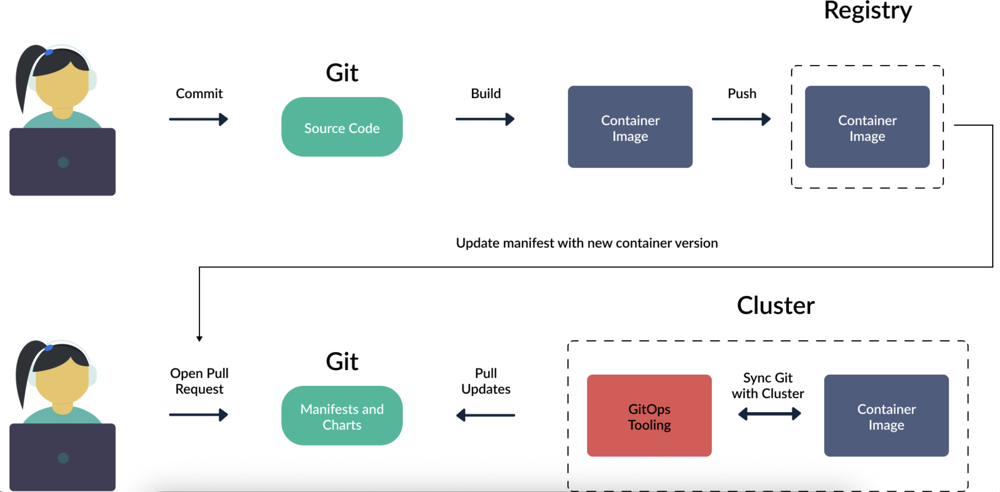

## GitOps with Argo CD

### 1. GitOps
GitOps is a set of best practices where the entire code delivery process is managed through Git. Both infrastructure and applications are defined as code, and automation is used to perform deployments, updates, and rollbacks.

Key GitOps principles:

- The entire system (infrastructure and applications) is described declaratively.
- The desired state of the system is versioned and stored in Git.
- Approved changes are automatically applied to the system.
- Software agents continuously ensure correctness and alert on any drift.

In Kubernetes, GitOps deployments typically work like this:

- A GitOps agent is deployed in the cluster.
- The agent monitors one or more Git repositories that define applications using Kubernetes manifests, Helm charts, or Kustomize files.
- When a new Git commit is pushed, the agent reconciles the cluster so that its state matches what is described in Git.
- All changes are made via Git operations; the cluster is never modified directly (no manual `kubectl` commands).

With GitOps, the deployment process looks like this:

- A developer commits application source code; the CI system builds a container image and pushes it to a registry.
- Nobody has direct access to the Kubernetes cluster. A separate Git repository stores the manifests that define the application.
- Another human or an automated system updates the manifests in this second Git repository.
- A GitOps controller running inside the cluster watches this repository and, when it detects changes, updates the cluster to match the state declared in Git.



Key points:
- The state of the cluster is always described in Git; Git contains everything related to the application, not just the source code.
- There is no external CI/deployment system with full write access to the cluster; instead, the cluster pulls changes and deployment information from Git.
- The GitOps controller runs continuously, reconciling the actual cluster state with the desired state stored in Git.

### GitOps use cases

- Continuous deployment


## Argo CD

### Introduction
We will apply GitOps practices to Kubernetes applications using Argo CD as our GitOps controller.

Argo CD implements the GitOps principles described above in the following way:

- Argo CD is installed as a controller in a Kubernetes cluster. It is typically installed on the same cluster it manages, but it can also manage external clusters.
- Application manifests are stored in Git. Argo CD is agnostic about the type of manifests you use: it supports plain Kubernetes manifests, Helm charts, Kustomize overlays, and other templating mechanisms.
- You define an Argo CD Application that specifies which Git repository (and path/revision) to track and which cluster/namespace to deploy to.
- From that point on, Argo CD continuously monitors the Git repository. When it detects a change, it reconciles the cluster so that its state matches what is declared in Git.
- Optionally, a single Argo CD installation can deploy and manage applications across multiple clusters, not just the cluster where Argo CD itself runs.


### Installation

Rancher local cluster: 
```bash
kubectl config use-context rancher-desktop
```

```bash
kubectl create namespace argocd
kubectl apply -n argocd -f https://raw.githubusercontent.com/argoproj/argo-cd/stable/manifests/install.yaml
```
It is also possible to install it by https://github.com/argoproj-labs/argocd-autopilot.

Check that all Argo CD components are running:

```bash
kubectl get pods -n argocd
```

Regarding configuration options, Argo CD can be customized a lot after the initial installation.

Decide how to expose Argo CD API/UI to your users.
Decide how users are going to authenticate to Argo CD.

Exposing your Argo CD to users will be a different process depending on your organization, but in most cases, you should make the Argo CD UI available to external traffic via a Kubernetes ingress.
```bash
kubectl port-forward svc/argocd-server -n argocd 8080:443
```

Initial password
```bash
kubectl -n argocd get secret argocd-initial-admin-secret \
-o jsonpath="{.data.password}" | base64 --decode
```

### Connect repository

TBD.

### Creating an application

An application can be created in Argo CD from the UI, CLI, or by writing a Kubernetes manifest that can then be passed to kubectl to create resources.
First, navigate to the +NEW APP on the left-hand side of the UI.
Next, add the following to create the application:

General Section:
  - Application Name: TBD
  - Project: default
  - Sync Policy: Automatic

Source Section:
  - Repository URL/Git: this is the Git repository URL (e.g. GitHub/Gitlab)
  - Branches: main
  - Path: TBD

Destination Section:
  - Cluster URL: select the cluster URL you are using
  - Namespace: default

Then, click CREATE and you have now created your Argo CD application.

### Syncing an application

Initially, the application is in OutOfSync state since the application has yet to be deployed, and no Kubernetes resources have been created.
We have created our application in Argo CD, but it is still not deployed as it only exists in Git right now. 

We need to tell Argo CD to make the Git state equal to the cluster state.
To synchronize/deploy the Argo CD app click the <code>Sync button</code>.

Check the state:
```bash
kubectl get deployments
```

### Change syncing policy to Automatic using ArgoCD
ArgoCD supports Automatic sync policy for the applications if we enable them - it will automatically sync the application when there is a change in the Git repository.

By default, the sync period is 3 minutes. This means that every 3 minutes Argo CD will:
- Gather all applications that are marked to auto-sync.
- Fetch the latest Git state from the respective repositories.
- Compare the Git state with the cluster state.
- Take an action:
  - If both states are the same, do nothing and mark the application as synced.
  - If states are different mark the application as "out-of-sync".


